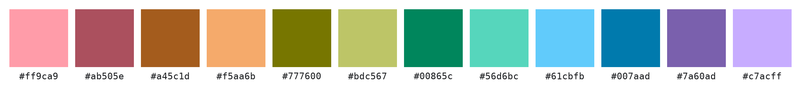
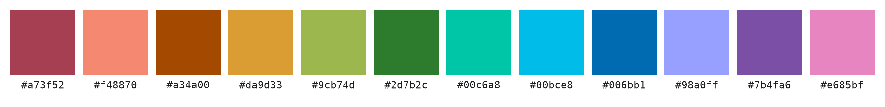

# Twelve Colors, No Confusion

Twelve-color palettes for charts, maps, and dashboards. Most categorical
palettes blur together well before hitting twelve categories, so each of
these four was searched by directly maximizing CIEDE2000 instead — the metric
closest to how people actually judge color similarity. Every color stays
inside sRGB, so it renders the same on any screen.

Colors within each palette are sorted by hue below, not by which ring they
came from, so the four rows compare at a glance.

## The palettes

### Two rings of six — 6+6


### Two rings of six, one shared chroma — 6+6:C (best)



### Rings of five and seven — 5+7


### Rings of five and seven, one shared chroma — 5+7:C



## Why these work

- **One constraint per palette.** Every color in a palette sits on a *ring*: a
  fixed Oklab lightness `L` and chroma `C`, differing only in hue. `6+6` and
  `5+7` split the 12 colors across two such rings; `6+6:C` and `5+7:C` force
  both rings to the same chroma. Because so little is free to vary, the colors
  read as one deliberate set instead of a grab bag.
- **The worst pair is what was optimized, not the average.** The search
  maximizes the *smallest* CIEDE2000 distance over all 66 pairs in the
  palette — not the average pair, the closest one. Nothing in a palette is
  more confusable than that.
- **Every color stays in sRGB.** No color needs a wide-gamut display or gets
  clipped and dulled on a normal one.

The four palettes above score close enough to each other that picking between
them is mostly a matter of taste — `6+6` and `6+6:C` split the colors evenly,
`5+7` and `5+7:C` split them 5-and-7. The exact scores, the ΔE00 matrices, and
what other layouts were tried and dropped are in [EXPERIMENTS.md](EXPERIMENTS.md).

## Use a palette

Each palette's full data — hue and chroma per color, which ring it's on, the
CIEDE2000 matrix — is in `results/*.json` and loads with `palette_lab.palette.load`:

```sh
uv run scripts/visualize_palette.py results/6+6-sharedC.json
```

To regenerate everything from scratch, see [EXPERIMENTS.md](EXPERIMENTS.md#run-it).
