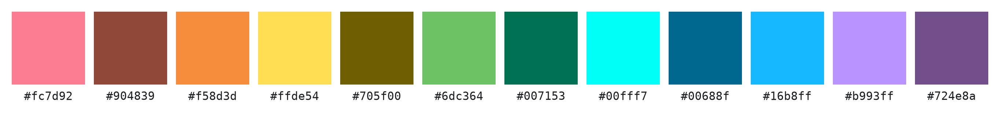
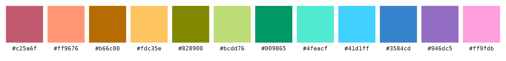

# Twelve Colors, No Confusion

Twelve categories on one chart, and every one of them tells itself apart.

## 5+5+2 — The Clearest



```
#fc7d92  #904839  #f58d3d  #ffde54  #705f00  #6dc364
#007153  #00fff7  #00688f  #16b8ff  #b993ff  #724e8a
```

The clearest twelve here, by 12%. Five muted colors, five vivid ones, and two
bright ones on top. Twelve lines on one chart, and not one of them needs a
second look.

## bright12 — For Dark Screens



```
#c25a6f  #ff9676  #b66c00  #fdc35e  #828900  #bcdd76
#009865  #4feacf  #41d1ff  #3584cd  #946dc5  #ff9fdb
```

Built for a dark background and a phone with the brightness turned down. Nothing
here is dark enough to sink into the background, and every color carries exactly
the same saturation. Turn the screen down until a normal chart gives up, and
these twelve are still twelve.

## 6+6 — The Most Uniform


```
#ff9ca9  #ab505e  #a45c1d  #f5aa6b  #777600  #bac669
#00865c  #56d6bc  #61cbfb  #007aad  #7a60ad  #c7acff
```

Six light, six dark, every one at the same saturation. The most even-tempered
palette here, and the one that holds up best on a white page. Drop it into a
twelve-series chart and stop thinking about the legend.

## 5+7 — The Most Vivid


```
#a73f52  #f48870  #a34a00  #da9d33  #9cb74d  #2c7b2c
#00c6a8  #00bce8  #006bb1  #98a0ff  #7b4fa6  #e685bf
```

Same twelve slots, more color. An uneven split buys extra saturation, so the
chart comes out lively and still reads clean. Take this one when the deck has
to look good, not only work.

## Why and How

You have twelve things to plot and one chart to plot them in. Pick the colors
by hand and two of them always land too close, so your reader ends up looking
back at the legend to check which line was which. Most ready-made palettes
have the same problem — they hold up to about eight colors and quietly fall
apart after that.

**Every pair was checked, not just the palette as a whole.** Twelve colors
make 66 possible pairs. These were found by scoring all 66 and pushing the
*closest* one as far apart as it would go. Averages are the trap: a palette
can average beautifully while two of its colors stay twins. Here the weakest
pair is as strong as it can be, and the weakest pair is the only one your
reader will ever trip on.

**Brightness does the work hue cannot.** Ask hue alone to separate twelve
colors and the palette comes out about half as clear, because there is not
room for twelve distinguishable hues. Add a brightness difference and the eye
gets a second thing to sort by, so neighbors stop competing. `6+6` and `5+7`
use two brightness levels. `5+5+2` uses three, which is most of why it wins.
`bright12` gives every color its own.

**They still look like a set.** `6+6`, `5+7` and `bright12` give every color the
same saturation. `5+5+2` uses two — one for its five muted colors and one shared
by the other seven — so it reads as two deliberate groups rather than twelve
picks off a color wheel. All of them sit inside sRGB, so nothing needs a
wide-gamut monitor and nothing dulls out on someone else's screen.

**Nothing is too dark to use.** No color goes below Oklab lightness 0.48, and in
`bright12` nothing goes below 0.60, so none of them turn to mud on a dimmed phone
or a cheap projector.

**bright12 is the one to reach for on a dark surface, and the wrong one on
paper.** It is the only palette here with a ceiling as well as a floor: every
color sits between Oklab lightness 0.60 and 0.85. That band is what a dimmed
screen can still render. Turn a display down to a tenth of its output and
`bright12` holds its worst pair at ΔE00 10.6, against 9.2 for `6+6` and 8.5 for
`5+7`, because neither of those has a floor and their darkest colors crush toward
black. The same band makes it the faintest of the four on white. That trade is
the point of it, not a flaw in it.

**Where 5+5+2 gives ground is a white background.** Its two bright colors,
`#ffde54` and `#00fff7`, sit at 1.26:1 contrast there, so they hold up as filled
areas and bars and go too faint for thin lines or small text. `6+6` is the safer
pick on white, at 1.79:1 worst case.

Every palette is listed in hue order, swatch and code alike, so you can compare
them row against row.

## More Detail

Copy the twelve hex codes and you're done. If you want more, every
palette ships its full data — hue and chroma per color, which ring it sits on,
the CIEDE2000 matrix — in `results/*.json`, loaded by
`palette_lab.palette.load`:

```sh
uv run scripts/visualize_palette.py results/5+5+2.json
```

[EXPERIMENTS.md](EXPERIMENTS.md) has the exact scores, the ΔE00 matrices, the
layouts that were tried and dropped — including versions where each ring keeps
its own saturation — and how to regenerate all of it from scratch. It also
answers the strangest result of the search: on `6+6` the two rings land on
nearly the same hues, within 4°, which looks like a bug and is not.

## License

MIT, in [LICENSE](LICENSE) — that covers the code. The colors themselves are
twelve numbers, so take them and go.
