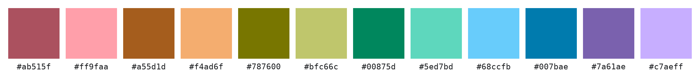
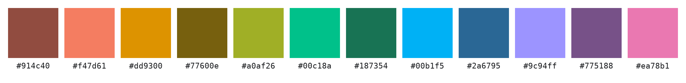

# Twelve Colors, No Confusion

Twelve categories on one chart, and every one of them tells itself apart.

## 6+6 — The More Separated of the Two



The safe pick. Six light, six dark, and no two of them ever get mistaken for
each other. Drop it into a twelve-series chart and stop thinking about the
legend.

## 5+7 — The More Vivid of the Two


Same twelve slots, more color. An uneven split buys extra saturation, so the
chart comes out lively and still reads clean. Take this one when the deck has
to look good, not only work.

## Why and How

You have twelve things to plot and one chart to plot them in. Pick the colors
by hand and two of them always land too close, so your reader ends up looking
back at the legend to check which line was which. Most ready-made palettes
have the same problem — they hold up to about eight colors and quietly fall
apart after that.

**Every pair was checked, not just the palette as a whole.** Twelve colors
make 66 possible pairs. These were found by scoring all 66 and pushing the
*closest* one as far apart as it would go. Averages are the trap: a palette
can average beautifully while two of its colors stay twins. Here the weakest
pair is as strong as it can be, and the weakest pair is the only one your
reader will ever trip on.

**Half the colors are light, half are dark.** That is the move that makes
twelve work. Ask hue alone to do the job and the palette comes out about half
as clear, because there simply is not room for twelve distinguishable hues.
Add a light-dark difference and the eye gets a second thing to sort by, so
neighbors stop competing.

**They still look like a set.** Every color carries the same saturation, so
the twelve read as one deliberate palette instead of twelve picks off a color
wheel. And all of them sit inside sRGB — no wide-gamut monitor needed, nothing
that dulls out on someone else's screen.

Between the two: 6+6 is the most separated palette here, and 5+7 gives up a
sliver of that for noticeably more saturation. Either is safe. The swatches
above run in hue order so you can compare them row against row.

### Variation: 5+7 Without the Shared Chroma



Let the light and dark halves pick their own saturation and one half turns
muted next to the other. It separates a hair better than the 5+7 above, and it
gives up the matched-set look. Take it only if you want that contrast — muted
against vivid — on purpose.

## More Detail

Grab the hex codes off the swatches and you're done. If you want more, every
palette ships its full data — hue and chroma per color, which ring it sits on,
the CIEDE2000 matrix — in `results/*.json`, loaded by
`palette_lab.palette.load`:

```sh
uv run scripts/visualize_palette.py results/6+6-sharedC.json
```

[EXPERIMENTS.md](EXPERIMENTS.md) has the exact scores, the ΔE00 matrices, the
layouts that were tried and dropped — including a plain `6+6` where each ring
keeps its own chroma — and how to regenerate all of it from scratch. It also
answers the strangest result of the search: the two rings land on nearly the
same hues, within 4°, which looks like a bug and is not.
